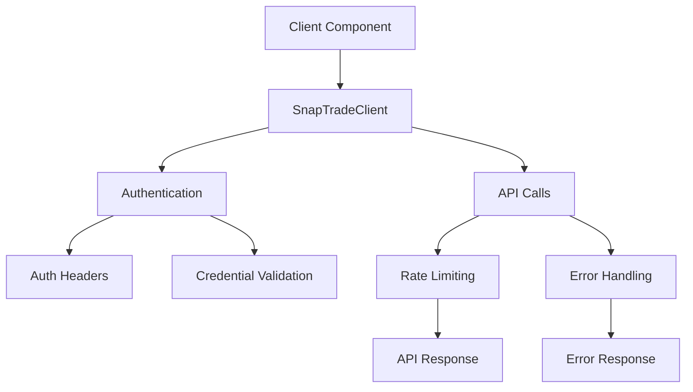

# SnapTrade Integration Structure

## Directory Structure

```
src/lib/snaptrade/
├── client.ts           # Main SDK client implementation
├── auth.ts             # Authentication utilities
├── types.ts            # Type definitions
├── config.ts           # Configuration
├── errors.ts           # Error handling
├── storage.ts          # Secure storage
├── rateLimiter.ts      # Rate limiting
├── test.ts             # Testing utilities
└── README.md           # Integration documentation
```

## File Responsibilities

### `client.ts`
- Main SDK client implementation
- Wraps official SnapTrade SDK
- Handles API calls
- Manages authentication state
- Implements error handling

### `auth.ts`
- Authentication utilities
- Header generation
- Credential validation
- Security checks
- Token management

### `types.ts`
- TypeScript type definitions
- SDK type extensions
- Custom type definitions
- Error types
- Configuration types

### `config.ts`
- Configuration management
- Environment variables
- API endpoints
- Feature flags
- Default settings

### `errors.ts`
- Error handling
- Custom error types
- Error codes
- Error messages
- Error utilities

### `storage.ts`
- Secure storage
- Session management
- Credential storage
- Data encryption
- Storage utilities

### `rateLimiter.ts`
- Rate limiting
- API throttling
- Request queuing
- Backoff strategies
- Rate limit handling

### `test.ts`
- Testing utilities
- Mock data
- Test helpers
- Integration tests
- Unit tests

## Integration Flow



## Usage Examples

### Component Integration
```typescript
// components/BrokerConnection.tsx
import snaptradeClient from '@/lib/snaptrade/client';

const BrokerConnection = () => {
  const connect = async () => {
    try {
      const response = await snaptradeClient.createConnectionLink({
        broker: 'questrade',
        immediateRedirect: true
      });
      // Handle response
    } catch (error) {
      // Handle error
    }
  };
};
```

### Service Integration
```typescript
// services/brokerService.ts
import snaptradeClient from '@/lib/snaptrade/client';

export const getAccounts = async () => {
  try {
    return await snaptradeClient.getUserAccounts();
  } catch (error) {
    // Handle error
  }
};
```

## Best Practices

1. **Client Usage**
   - Use the singleton client instance
   - Handle all errors appropriately
   - Follow rate limiting guidelines
   - Validate input parameters

2. **Authentication**
   - Never store credentials in plain text
   - Use secure storage for sensitive data
   - Validate credentials before use
   - Handle token expiration

3. **Error Handling**
   - Use custom error types
   - Provide meaningful error messages
   - Log errors appropriately
   - Handle specific error cases

4. **Type Safety**
   - Use TypeScript's strict mode
   - Validate input types
   - Use proper type assertions
   - Document type requirements

## Testing Structure

```
__tests__/
├── client.test.ts
├── auth.test.ts
├── storage.test.ts
└── integration/
    ├── connection.test.ts
    └── accounts.test.ts
```

## Security Considerations

1. **Authentication**
   - Use secure storage
   - Implement proper CORS
   - Handle token expiration
   - Validate credentials

2. **Data Protection**
   - Encrypt sensitive data
   - Use secure headers
   - Implement rate limiting
   - Handle errors securely

3. **API Security**
   - Validate all input
   - Use proper error handling
   - Implement request signing
   - Follow security best practices

## References

- [SnapTrade API Documentation](https://docs.snaptrade.com)
- [SnapTrade TypeScript SDK](https://github.com/passiv/snaptrade-sdks)
- [Project Security Guidelines](../SECURITY.md)
- [Error Handling Guidelines](../ERROR_HANDLING.md) 